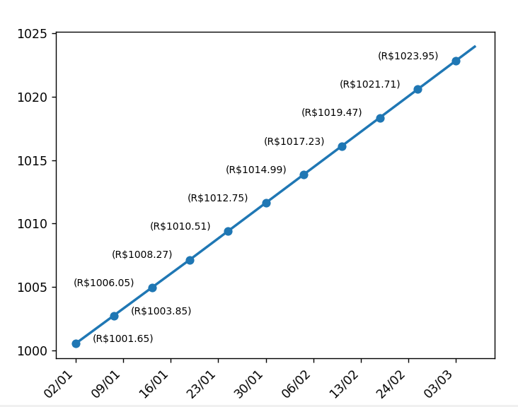

# Simulador de Investimento com Taxa Selic (ETL)

Projeto desenvolvido durante o bootcamp da [DIO](https://www.dio.me/) em parceria com a TOTVS, com foco em ETL (Extract, Transform, Load) aplicado a dados financeiros públicos.

## 📊 Descrição

Este projeto realiza a extração dos dados da taxa Selic diretamente da API do Banco Central do Brasil, solicita ao usuário um valor inicial e simula a evolução do patrimônio ao longo do tempo, considerando os juros diários. O resultado é apresentado em um gráfico de fácil visualização.

## 🚀 Funcionalidades

- **Extract:** Consumo dos dados da taxa Selic via API do Banco Central.
- **Transform:** Cálculo da progressão do patrimônio com base em juros compostos diários.
- **Load:** Visualização do crescimento do investimento em um gráfico.
- **Tratamento de erros:** Implementação de tratamento de exceções para garantir robustez ao consumir a API.

## 🛠️ Tecnologias e Bibliotecas

- [Python 3.x](https://www.python.org/)
- [pandas](https://pandas.pydata.org/) – Manipulação e análise de dados
- [matplotlib](https://matplotlib.org/) – Visualização gráfica
- [requests](https://docs.python-requests.org/) – Consumo de APIs REST

## ⚙️ Como executar

1. Clone este repositório:
   ```bash
   git clone https://github.com/kersbaumerHugo/Projeto_DIO_ETL_Python.git
   ```
2. Instale as dependências:
   ```bash
   pip install pandas matplotlib requests
   ```
3. Execute o script principal:
   ```bash
   python simulador_selic.py
   ```
##📷 Exemplo





##💡 Aprendizados
Consumo de APIs públicas e manipulação de dados em tempo real.
Aplicação de lógica de juros compostos para simulação financeira.
Visualização de dados para facilitar a tomada de decisão.
Tratamento de erros para garantir robustez do sistema.

##📈 Possíveis melhorias
Permitir escolha de outros índices (ex: CDI, IPCA).
Exportar resultados para CSV ou Excel.
Interface gráfica para facilitar o uso.
Deploy como aplicação web.

##📬 Contato
Fique à vontade para entrar em contato pelo [LinkedIn](https://www.linkedin.com/in/hugo-kersbaumer/) ou abrir uma issue neste repositório!